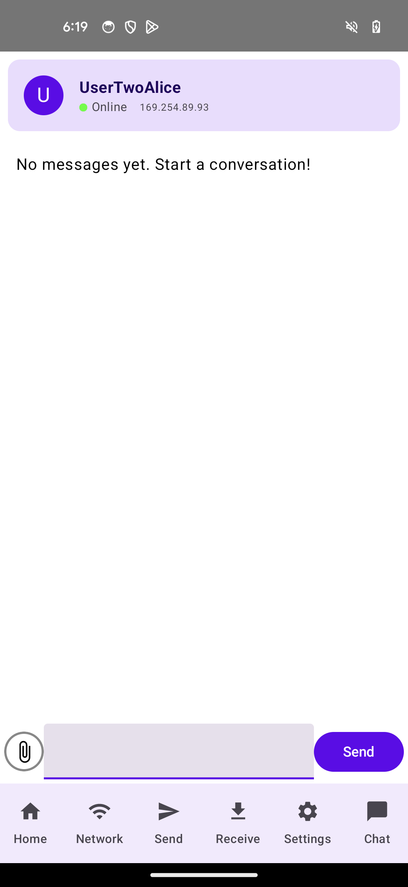
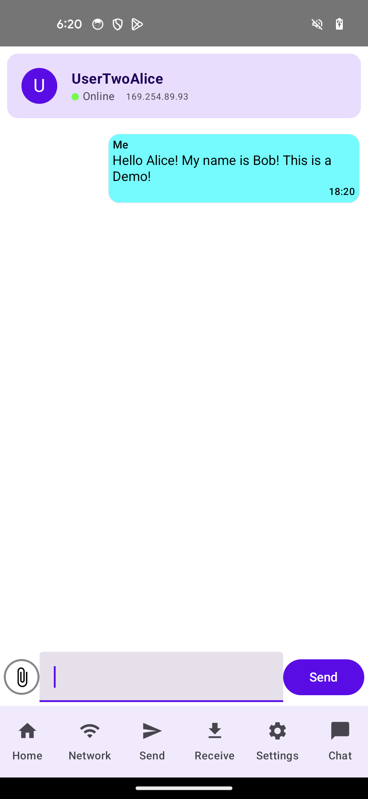

# Messaging Module Documentation

## Overview
The messaging module is a core component of Project Mesh that enables peer-to-peer text communications between devices on the local mesh network. It provides a structured architecture for sending, receiving, storing, and displaying messages without requiring internet connectivity.

## Package Structure
```
messaging/
├── data/          # Data layer (entities and DAOs)
│   ├── dao/       # Database Access Objects
│   └── entities/  # Data models (Message, Conversation)
├── network/       # Network communication handlers
├── repository/    # Business logic and data management
└── ui/            # User interface components
├── models/    # UI state models
├── screens/   # Composable UI screens
└── viewmodels/# View state management
```
## Core Components 

### 1. Data Models 
#### Message Entity 
```Kotlin 
@Serializable
@Entity(tableName = "message")
data class Message(
    @PrimaryKey(autoGenerate = true) val id: Int,
    @ColumnInfo(name = "dateReceived") val dateReceived: Long,
    @ColumnInfo(name = "content") val content: String,
    @ColumnInfo(name = "sender") val sender: String,
    @ColumnInfo(name = "chat") val chat: String,
    @ColumnInfo(name= "file") val file: URI? = null
)
```
#### Conversation Entity
```Kotlin 
@Entity(tableName = "conversations")
data class Conversation(
    @PrimaryKey val id: String, // Composite ID of the two users
    @ColumnInfo(name = "user_uuid") val userUuid: String, // Other user ID
    @ColumnInfo(name = "user_name") val userName: String, // Other user name
    @ColumnInfo(name = "user_address") val userAddress: String?, // Other user IP address
    @ColumnInfo(name = "last_message") val lastMessage: String?, // Last message text
    @ColumnInfo(name = "last_message_time") val lastMessageTime: Long, // Timestamp
    @ColumnInfo(name = "unread_count") val unreadCount: Int = 0, // Unread count
    @ColumnInfo(name = "is_online") val isOnline: Boolean = false // Online status
)
```
### 2. Repositories
#### MessageRepository
Manages message data operations, including retrieving and storing messages.
#### ConversationRepository
Manages conversation data, including creating and updating conversations, tracking user statuses, and managing unread messages.
### 3. Network Components
#### MessageNetworkHandler
   Handles network communication for sending and receiving messages using HTTP requests.
### 4. UI Components
#### ChatScreen
   Displays messages in a conversation and provides UI controls for sending new messages. 
#### ConversationsHomeScreen
   Displays a list of all conversations with status indicators and message previews.

## Architecture and Data Flow
### Message Flow

#### 1. User Sends Message:
* User enters text in ChatScreen and taps Send
* ChatScreenViewModel processes the input
* Message is first saved locally in the database
* MessageNetworkHandler sends the message to recipient via HTTP
#### 2. Message Reception:
* AppServer receives HTTP request on /chat endpoint
* MessageNetworkHandler processes the incoming message
* Message is stored in local database
* ConversationRepository updates the conversation
* UI is updated via StateFlow collection

### Integration with Project Mesh Components
#### Network Integration
Messages are transmitted over the mesh network created by the Meshrabiya library. The system uses:

1. `AppServer`: Provides HTTP endpoints for receiving messages and handles file transfers.
2. `DeviceStatusManager`: Tracks online/offline status of devices to determine message deliverability.
3. `AndroidVirtualNode`: Manages the underlying mesh network connections.

```kotlin 
// In AppServer.kt
// Handles incoming chat messages
else if(path.startsWith("/chat")) {
    // Process JSON payload
    val chatMessage = deserialzedJSON.content
    val time = deserialzedJSON.dateReceived
    val senderIp = deserialzedJSON.sender
    
    // Handle message via MessageNetworkHandler
    val message = MessageNetworkHandler.handleIncomingMessage(
        chatMessage, time, senderIp, incomingfile
    )
    
    // Save to database
    db.messageDao().addMessage(message)
}
```

#### User System Integration 
Messages and conversations are linked to user profiles:
1. Each message contains a sender field with the username
2. Conversations use a composite ID created from the UUIDs of both participants
3. Online status is synchronized with the DeviceStatusManager

```kotlin 
// In ConversationUtils.kt
fun createConversationId(uuid1: String, uuid2: String): String {
    // Sort UUIDs to ensure consistent IDs regardless of sender/receiver
    return listOf(uuid1, uuid2).sorted().joinToString("-")
}
```

#### Database Integration
The messaging module uses Room database for persistence:
1. **MeshDatabase**: Central database that contains tables for:
* `messages`: Stores all message content
* `conversations`: Stores conversation metadata
* `users`: Stores user profile information
2. Relationship Flow:
* Users have multiple Conversations
* Conversations contain multiple Messages
* Messages reference their Conversation via the chat field
```kotlin
// In MeshDatabase.kt
@Database(
    entities = [
        Message::class,
        UserEntity::class,
        Conversation::class
    ],
    version = 4,
    exportSchema = false
)
abstract class MeshDatabase : RoomDatabase() {
    abstract fun messageDao(): MessageDao
    abstract fun userDao(): UserDao
    abstract fun conversationDao(): ConversationDao
}
```
## Special Features
### Offline Messaging
1. Messages are always stored locally first
2. If recipient is offline, message remains in local database
3. UI indicates delivery status based on device connectivity
4. Messages appear in conversation history regardless of delivery status
### Test Device Integration
Special handling for test devices that simulate real users:
* Online test device automatically responds with echo messages
* Offline test device stores messages locally but never receives them

### File Attachments
1. Messages can include file URI attachments
2. Files are transferred separately using the file transfer system
3. Messages with attachments display file indicators in the UI
### Usage Example 

#### Conversations Screen: 

* Online and Offline Users Appear With Appropriate Read Receipts from Built-in Sample Messages
* Connected device appears in the Conversation Screen

#### Chat Screen Initial Impressions 

* When chatting for the first time a prompt appears to start a chat

#### Sending A Message

**Example**: Bob sends Message to Alice


```kotlin
// In ChatScreenViewModel.kt
fun sendChatMessage(virtualAddress: InetAddress, message: String, file: URI?) {
    val sendTime = System.currentTimeMillis()
    val isOnline = DeviceStatusManager.isDeviceOnline(ipAddress)
    
    // Create message entity
    val messageEntity = Message(
        id = 0,
        dateReceived = sendTime,
        content = message,
        sender = "Me",
        chat = chatName,
        file = file
    )
    
    viewModelScope.launch {
        // Save to local database
        db.messageDao().addMessage(messageEntity)
        
        // Update conversation
        conversationRepository.updateWithMessage(
            conversationId = conversation.id,
            message = messageEntity
        )
        
        // Send message if recipient is online
        if (isOnline) {
            appServer.sendChatMessageWithStatus(
                virtualAddress, sendTime, message, file
            )
        }
    }
}
```
#### Receiving and Displaying Messages 

**Example**: Bob Recieves Message From Alice

1. Conversation is Updated and Read Receipt is shown: 

2. Bob can View the message in the Chat Screen

3. When Going back to the Chat Screen Read Status is Updated: 


```kotlin
// In ChatScreenViewModel.kt
init {
    viewModelScope.launch {
        // Observe message database for this conversation
        db.messageDao().getChatMessagesFlow(chatName).collect { newChatMessages ->
            _uiState.update { prev ->
                prev.copy(allChatMessages = newChatMessages)
            }
        }
    }
}
```
## Best Practices
### 1. Consider Network Conditions:
* Always check device online status before sending 
* Provide clear UI feedback for undelivered messages 
* Handle intermittent connectivity gracefully

### 2. Database Operations:
* Perform all database operations on IO dispatchers
* Use Room's Flow API for reactive UI updates
* Keep transactions atomic to prevent data corruption

### 3. User Experience:
* Show clear online/offline indicators
* Provide delivery status for messages
* Update conversation timestamps and previews promptly

### 4. Security Considerations:
* Validate message content before processing
* Use proper JSON schema validation for incoming messages
* Sanitize user input to prevent injection attacks

## Troubleshooting
### Common Issues
#### 1. Messages Not Sending:
* Check device status in DeviceStatusManager
* Verify network connectivity between devices
* Confirm AppServer is running on both devices

#### 2. Missing Conversations:
* Ensure user profile exchange was successful
* Check conversation ID generation is consistent
* Verify database migrations have completed

#### 3. UI Not Updating:
* Confirm StateFlow collection is active
* Check database queries are properly observed
* Verify Composable recomposition triggers

## Future Enhancements
1. **Message Encryption**: Add end-to-end encryption for message content
2. **Message Status**: Add read receipts and delivery confirmations
3. **Rich Media**: Enhance support for images, videos, and other media types
4. **Group Messaging**: Extend the system to support multi-user conversations
