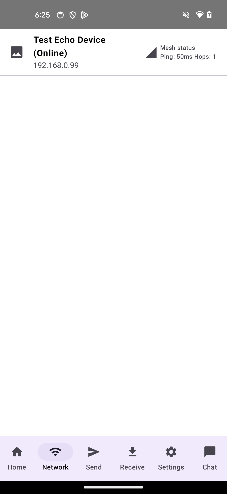
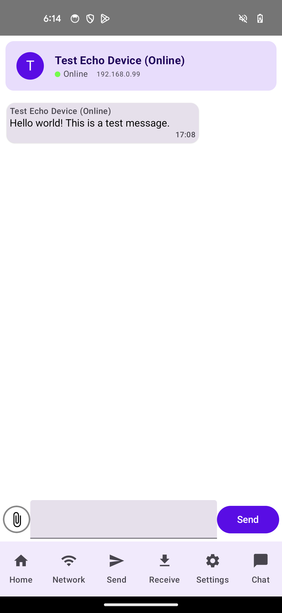
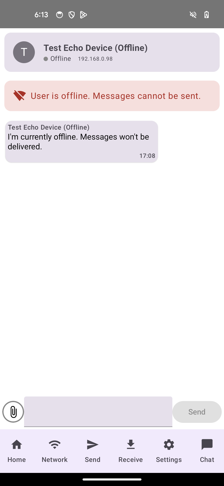

# Test Users in Project Mesh

## Overview

Project Mesh includes built-in test users to help with development and testing. These virtual devices simulate real connections and messaging behavior without requiring actual physical devices to be connected to the mesh network.

## Available Test Users

The application includes two test users:

1. **Online Test Device**
    - Name: "Test Echo Device (Online)"
    - IP Address: 192.168.0.99
    - Status: Always appears as online
    - Behavior: Automatically responds to messages with an echo reply

2. **Offline Test Device**
    - Name: "Test Echo Device (Offline)"
    - IP Address: 192.168.0.98
    - Status: Always appears as offline
    - Status: Always appears as offline
    - Behavior: Messages can be sent but will remain stored locally

**Only Online User Shows Up as Online**:



## Test User Features

- **Automatic Initialization**: Test users are automatically initialized when the app starts.
- **Persistent Conversations**: Conversations with test users persist across app restarts.
- **Echo Functionality**: The online test device automatically responds to messages with an "Echo: [your message]" reply.
- **Status Management**: Test devices maintain consistent online/offline status regardless of network conditions.

## Usage Examples

### Testing Message Delivery
1. Navigate to the Chat screen
2. Select "Test Echo Device (Online)" from the conversation list
3. Send a message
4. You should receive an echo reply within seconds



### Testing Offline Message Behavior
1. Navigate to the Chat screen
2. Select "Test Echo Device (Offline)" from the conversation list
3. Send a message
4. The message will show as sent but will be stored locally with an offline indicator



## Technical Implementation

The test devices are implemented through several components:

- `TestDeviceService`: Main service that manages test device creation and behavior
- `TestDeviceEntry`: Creates virtual network entries for test devices
- `TestVirtualRouter`: Simulates network routing for test devices
- `DeviceStatusManager`: Handles special status tracking for test devices

## Customization

To modify test device behavior, you can edit the following properties in `TestDeviceService.kt`:

```kotlin
// Define test device properties
const val TEST_DEVICE_IP = "192.168.0.99"
const val TEST_DEVICE_NAME = "Test Echo Device (Online)"
const val TEST_DEVICE_IP_OFFLINE = "192.168.0.98"
const val TEST_DEVICE_NAME_OFFLINE = "Test Echo Device (Offline)"
```

## Test User Integration

### How Test Users Connect with the Project Mesh Architecture
Test users are integrated into several key components of the Project Mesh architecture to simulate real devices without requiring actual physical connections. Here's how they interface with the core systems:
1. TestDeviceService Integration
```kotlin 
// In TestDeviceService.kt
companion object {
    const val TEST_DEVICE_IP = "192.168.0.99"
    const val TEST_DEVICE_NAME = "Test Echo Device (Online)"
    const val TEST_DEVICE_IP_OFFLINE = "192.168.0.98"
    const val TEST_DEVICE_NAME_OFFLINE = "Test Echo Device (Offline)"

    private var isInitialized = false
    private var offlineDeviceInitialized = false

    fun initialize() {
        try {
            if (!isInitialized) {
                runBlocking {
                    val existingUser = userRepository.getUserByIp(TEST_DEVICE_IP)
                    if (existingUser == null) {
                        // If there's no user with this IP, insert one with a "temp" UUID
                        val pseudoUuid = "temp-$TEST_DEVICE_IP"
                        userRepository.insertOrUpdateUser(
                            uuid = pseudoUuid,
                            name = TEST_DEVICE_NAME,
                            address = TEST_DEVICE_IP
                        )
                    } else {
                        // If a user with this IP already exists, just update the name
                        userRepository.insertOrUpdateUser(
                            uuid = existingUser.uuid,
                            name = TEST_DEVICE_NAME,
                            address = existingUser.address
                        )
                    }
                }
                isInitialized = true
                Log.d("TestDeviceService", "Test device initialized successfully with IP: $TEST_DEVICE_IP")

                //initialize offline test device
                initializeOfflineDevice()
            }
        } catch (e: Exception) {
            Log.e("TestDeviceService", "Failed to initialize test device", e)
        }
    }
    
    // Additional methods for test device functionality...
}
```
2. Global App Integration
```kotlin 
// In GlobalApp.kt
override fun onCreate() {
    super.onCreate()
    
    // Other initialization code...

    //Initialize test device:
    TestDeviceService.initialize()
    Log.d("MainActivity", "Test device initialized")
    
    // Test conversation setup
    insertTestConversations()
}

fun insertTestConversations() {
    GlobalScope.launch {
        try {
            //get database instance
            val db: MeshDatabase by di.instance()

            // Check if any messages exist first
            val existingMessages = db.messageDao().getAll()
            Log.d("GlobalApp", "Found ${existingMessages.size} existing messages")

            if (existingMessages.isEmpty()) {
                Log.d("GlobalApp", "No messages found, creating test messages...")

                val localUuid = GlobalUserRepo.prefs.getString("UUID", null) ?: "local-user"

                //insert test convo with online test device
                val testDevice = TestDeviceService.getTestDeviceAddress()
                val testUser = UserEntity(
                    uuid = "test-device-uuid",
                    name = TestDeviceService.TEST_DEVICE_NAME,
                    address = testDevice.hostAddress
                )

                //make sure the test user exists in the database
                GlobalUserRepo.userRepository.insertOrUpdateUser(
                    testUser.uuid,
                    testUser.name,
                    testUser.address
                )

                //create convo with the test device
                val onlineConversation =
                    GlobalUserRepo.conversationRepository.getOrCreateConversation(
                        localUuid = localUuid,
                        remoteUser = testUser
                    )

                //create online test message
                val onlineTestMessage = Message(
                    id = 0,
                    dateReceived = System.currentTimeMillis() - 3600000, // 1 hour ago
                    content = "Hello world! This is a test message.",
                    sender = TestDeviceService.TEST_DEVICE_NAME,
                    chat = "local-user-test-device-uuid"  // Use ONLY conversation ID format
                )

                //insert the message
                db.messageDao().addMessage(onlineTestMessage)

                // Also initialize offline test device with a separate conversation
                // Similar code for offline device...
            }
        } catch (e: Exception) {
            Log.e("GlobalApp", "Error inserting test conversation", e)
        }
    }
}
```
3. AppServer Integration 
```kotlin 
// In AppServer.kt
fun sendChatMessageWithStatus(address: InetAddress, time: Long, message: String, f: URI?): Boolean {
    try {
        if (TestDeviceService.isTestDevice(address)) {
            // Create an echo response from our test device
            val testMessage = Message(
                id = 0,
                dateReceived = System.currentTimeMillis(),
                content = "Echo: $message",
                sender = TestDeviceService.TEST_DEVICE_NAME,
                chat = TestDeviceService.TEST_DEVICE_NAME,
                file = f //dont send file with echo messages
            )

            // Store the echo response in our database
            db.messageDao().addMessage(testMessage)
            Log.d("AppServer", "Test device echoed message: $message")
            return true
        }
        
        // Normal chat message handling for real devices...
    }
    catch (e: Exception) {
        // Error handling...
    }
}

fun requestRemoteUserInfo(remoteAddr: InetAddress, port: Int = DEFAULT_PORT) {
    //Special handling for test devices
    val ipAddress = remoteAddr.hostAddress

    // Online test device should always be "online"
    if (ipAddress == TestDeviceService.TEST_DEVICE_IP) {
        DeviceStatusManager.updateDeviceStatus(ipAddress, true)
        return
    }

    // Offline test device should always be "offline"
    if (ipAddress == TestDeviceService.TEST_DEVICE_IP_OFFLINE) {
        DeviceStatusManager.updateDeviceStatus(ipAddress, false)
        return
    }
    
    // Normal remote user info handling for real devices...
}
```
4. DeviceStatusManager Integration 
```kotlin 
// In DeviceStatusManager.kt
object DeviceStatusManager {
    // Other properties and methods...
    
    //special test device addresses that should be handled differently
    private val specialDevices = setOf(
        "192.168.0.99",  // Online test device
        "192.168.0.98"   // Offline test device
    )
    
    fun updateDeviceStatus(ipAddress: String, isOnline: Boolean, verified: Boolean = false) {
        //if this is a special device, handle according to its predefined status
        if (ipAddress == "192.168.0.99") { // Online test device
            _deviceStatusMap.update { current ->
                val mutable = current.toMutableMap()
                mutable[ipAddress] = true
                mutable
            }
            Log.d("DeviceStatusManager", "Updated test device status for $ipAddress: online")
            return
        } else if (ipAddress == "192.168.0.98") { // Offline test device
            _deviceStatusMap.update { current ->
                val mutable = current.toMutableMap()
                mutable[ipAddress] = false
                mutable
            }
            Log.d("DeviceStatusManager", "Updated test device status for $ipAddress: offline")
            return
        }
        
        // Normal device status handling for real devices...
    }
    
    fun verifyDeviceStatus(ipAddress: String) {
        // Skip verification for special test devices
        if (ipAddress in specialDevices) {
            return
        }
        
        // Normal device verification for real devices...
    }
}
```
5. NetworkServiceViewModel Integration
```kotlin
// In NetworkScreenViewModel.kt
init {
    viewModelScope.launch {
        //create test device entry
        val testEntry = TestDeviceEntry.createTestEntry()

        node.state.collect { nodeState ->
            // Processing real node state...

            // Combine real nodes with test device
            val allNodesWithTest = nodeState.originatorMessages.toMutableMap()
            allNodesWithTest[testEntry.first] = testEntry.second

            Log.d("NetworkScreenViewModel", "Updating nodes. Count: ${allNodesWithTest.size}")
            Log.d("NetworkScreenViewModel", "Test device address: ${testEntry.first}")

            // Update UI state with combined nodes...
        }
    }
}
```
6. ConversationsHomeScreen Integration
   Test devices appear in the conversations list as either online or offline contacts, with special handling to ensure they have the correct status regardless of actual network conditions.
7. ChatScreen Integration
```kotlin 
// In ChatScreenViewModel.kt
fun sendChatMessage(virtualAddress: InetAddress, message: String, file: URI?) {
    // Other processing...
    
    viewModelScope.launch {
        //save to local database
        db.messageDao().addMessage(messageEntity)

        //update convo with the new message
        // ...
        
        if (isOnline) {
            try {
                // Send message to real device
                // ...
            } catch (e: Exception) {
                // Error handling...
            }
        }
    }
}
```

The test user system integrates smoothly with the existing architecture by implementing specialized handling at key decision points throughout the codebase. This allows the test devices to behave consistently and predictably while reusing much of the same code path as real devices.